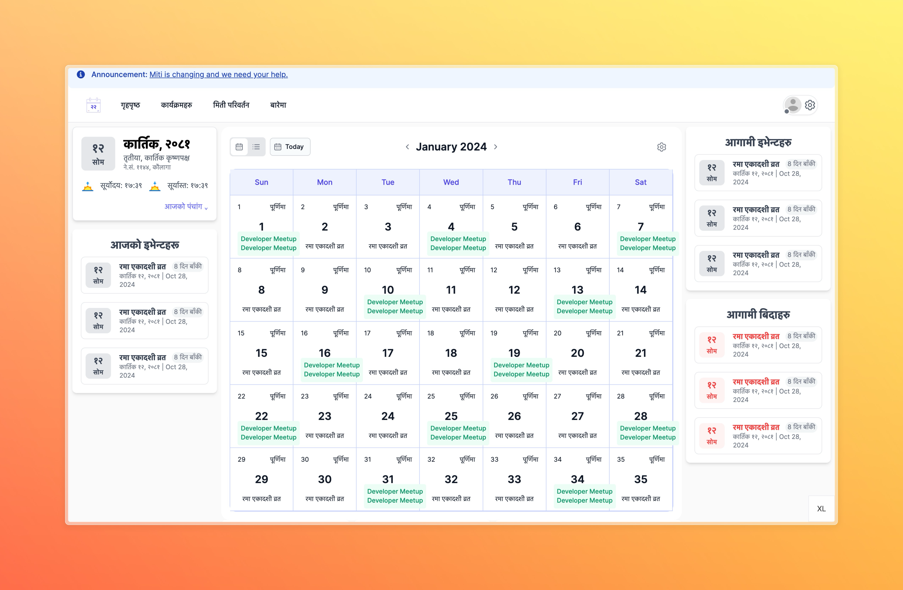

# Nepali Calendar UI

This project is a Nepali Calendar UI that follows the design stored in the `public` folder and utilizes a given GraphQL API from [SaralPatro](https://api.saralpatro.com/graphql). The UI design is provided by [Miti](https://github.com/PoskOfficial/Miti).



## Table of Contents

- [Installation](#installation)
- [Usage](#usage)
- [GraphQL API](#graphql-api)
- [Contributing](#contributing)
- [License](#license)

## Installation

1. Clone the repository:

```bash
git clone https://github.com/dev-sandip/calender-ui.git
```

2. Navigate to the project directory:

```bash
cd calendar-ui
```

3. Install the dependencies:

```bash
npm install
```

## Usage

1. Start the development server:

```bash
npm run dev
```

2. Open your browser and navigate to `http://localhost:5173` to see the Nepali Calendar UI.

## GraphQL API

This project uses a GraphQL API from [SaralPatro](https://api.saralpatro.com/graphql) to fetch calendar data. Ensure

### Example Query

```graphql
query {
  getCalendar(year: 2080, month: 1) {
    day
    month
    year
    events {
      title
      description
    }
  }
}
```

## Contributing

We welcome contributions! Please follow these steps:

1. Fork the repository.
2. Create a new branch:

```bash
git checkout -b feature-branch
```

3. Make your changes and commit them:

```bash
git commit -m "Description of changes"
```

4. Push to the branch:

```bash
git push origin feature-branch
```

5. Open a pull request.

## License

This project is licensed under the MIT License. See the [LICENSE](LICENSE) file for details.
